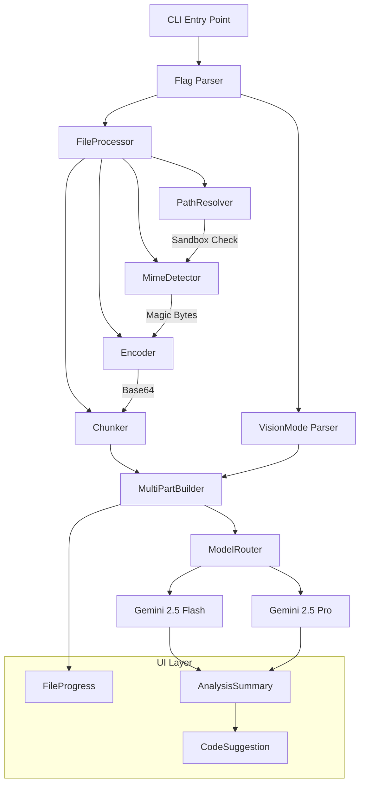

# VisionGuard AI

> Multi-modal Vision & Local Document Analysis extension for Gemini CLI

[](https://www.typescriptlang.org/)
[](https://nodejs.org/)
[](./LICENSE)
[](.)
[](.)

---

## Table of Contents

- [Features](#features)
- [Architecture](#architecture)
- [Quick Start](#quick-start)
- [CLI Usage](#cli-usage)
- [Supported File Types](#supported-file-types)
- [Model Auto-Selection](#model-auto-selection)
- [API Reference](#api-reference)
- [Project Structure](#project-structure)
- [Development](#development)
- [Testing](#testing)
- [Contributing](#contributing)
- [Security](#security)
- [License](#license)
- [Credits](#credits)

---

## Features

- **Image Analysis** -- Analyze PNG, JPEG, and WebP images with Gemini's vision capabilities
- **PDF Document Processing** -- Extract and analyze PDF documents with automatic page chunking
- **Magic-Byte MIME Detection** -- Secure file type detection via binary signatures, never relying on file extensions alone
- **Sandboxed Path Resolution** -- Symlink-aware path resolver that prevents directory traversal attacks
- **Smart Model Routing** -- Automatically selects Gemini 2.5 Flash or Pro based on input complexity
- **Streaming Encoder** -- Memory-efficient base64 encoding with backpressure for large files
- **Vision Modes** -- Five analysis modes: auto, describe, analyze, code-review, and diff
- **Terminal UI Components** -- Rich progress indicators, analysis summaries, and code suggestions built with Ink

---

## Architecture



---

## Quick Start

### 1. Install dependencies

```bash
npm install
```

### 2. Build

```bash
npm run build
```

### 3. Run

```bash
npx visionguard --file screenshot.png "What does this UI show?"
```

---

## CLI Usage

```
visionguard [options] [prompt]
```

### Options

| Flag | Short | Description |
|------|-------|-------------|
| `--file <path>` | `-f` | File(s) to analyze. Supports images (PNG, JPG, WebP) and documents (PDF). |
| `--vision [mode]` | `-v` | Vision analysis mode. Default: `auto` when flag is present. |
| `--model <name>` | | Force a specific Gemini model (`pro` or `flash`). |
| `--help` | `-h` | Show help message. |

### Multiple Files

```bash
# Multiple --file flags
visionguard --file a.png --file b.jpg "Compare these images"

# Comma-separated
visionguard --file a.png,b.jpg "Compare these images"
```

### Vision Modes

| Mode | Description |
|------|-------------|
| `auto` | Analyze based on content (default) |
| `describe` | Detailed content description |
| `analyze` | Thorough structural analysis |
| `code-review` | Code quality review and bug detection |
| `diff` | Compare multiple files for differences |

### Examples

```bash
# Analyze a screenshot
visionguard --file screenshot.png "What does this UI show?"

# Review code in an image
visionguard --file code.png --vision code-review

# Analyze a PDF document
visionguard --file report.pdf --vision analyze

# Compare two images
visionguard --file before.png,after.png --vision diff "What changed?"

# Force a specific model
visionguard --file diagram.png --model pro "Explain this architecture"
```

---

## Supported File Types

| Type | Extensions | Max Size | Encoding Method |
|------|------------|----------|-----------------|
| PNG | `.png` | 20 MB | Base64 `inline_data` |
| JPEG | `.jpg`, `.jpeg` | 20 MB | Base64 `inline_data` |
| WebP | `.webp` | 20 MB | Base64 `inline_data` |
| PDF | `.pdf` | 50 MB | Page-chunked base64 |

File types are detected via **magic byte signatures**, not file extensions, for security.

---

## Model Auto-Selection

VisionGuard automatically selects the optimal Gemini model:

```
IF --model flag provided        -> Use that model
ELSE IF PDF file                -> Gemini 2.5 Pro
ELSE IF multiple files          -> Gemini 2.5 Pro
ELSE IF complex prompt (>100t)  -> Gemini 2.5 Pro
ELSE IF code-related keywords   -> Gemini 2.5 Pro
ELSE                            -> Gemini 2.5 Flash (faster/cheaper)
```

Override with `--model pro` or `--model flash`.

---

## API Reference

### FileProcessor

```typescript
import { FileProcessor } from "@visionguard/core";

const processor = new FileProcessor({
  allowedDirectories: [process.cwd()],
  pdfChunkPages: 5,
});

const result = await processor.process({ path: "./image.png" });
// result: ProcessedFile { mimeType, category, encodedData, chunks?, ... }
```

### MultiPartBuilder

```typescript
import { MultiPartBuilder } from "@visionguard/core";

const builder = new MultiPartBuilder();
const content = builder.build("Describe this image", [processedFile]);
// content: { parts: [{ inlineData: ... }, { text: ... }] }
```

### ModelRouter

```typescript
import { ModelRouter } from "@visionguard/core";

const router = new ModelRouter();
const model = router.select({
  files: [processedFile],
  promptTokenEstimate: router.estimateTokens(prompt),
  promptText: prompt,
});
// model: "gemini-2.5-flash" | "gemini-2.5-pro"
```

### MimeDetector

```typescript
import { MimeDetector } from "@visionguard/core";

const detector = new MimeDetector();
const mimeType = await detector.detect("/path/to/file");
// mimeType: "image/png" | "image/jpeg" | "image/webp" | "application/pdf"
```

### PathResolver

```typescript
import { PathResolver } from "@visionguard/core";

const resolver = new PathResolver(["/allowed/dir"]);
const safePath = await resolver.resolve(userProvidedPath);
// Throws FileProcessorError on sandbox violation
```

---

## Project Structure

```
visionguard-ai/
├── packages/
│   ├── core/                          # Core processing library
│   │   └── src/
│   │       ├── file-processor/
│   │       │   ├── types.ts           # Shared types, enums, errors
│   │       │   ├── FileProcessor.ts   # Main orchestrator
│   │       │   ├── MimeDetector.ts    # Magic-byte MIME detection
│   │       │   ├── PathResolver.ts    # Sandbox-safe path resolution
│   │       │   ├── Encoder.ts         # Base64 encoding (buffered + streaming)
│   │       │   ├── Chunker.ts         # PDF page chunking
│   │       │   └── __tests__/         # Unit tests
│   │       └── request-builder/
│   │           ├── MultiPartBuilder.ts # Multi-part API request construction
│   │           └── ModelRouter.ts      # Gemini model auto-selection
│   ├── cli/                           # CLI entry point
│   │   └── src/
│   │       ├── index.ts               # Main CLI with arg parsing
│   │       └── flags/                 # --file and --vision flag handlers
│   └── ui/                            # Terminal UI components (Ink/React)
│       └── src/
│           └── components/
│               ├── FileProgress.tsx    # Processing progress indicator
│               ├── AnalysisSummary.tsx # Structured analysis output
│               └── CodeSuggestion.tsx  # Syntax-highlighted code blocks
├── package.json                       # Root workspace configuration
├── tsconfig.json                      # TypeScript project references
├── vitest.config.ts                   # Test configuration (90% coverage)
└── .eslintrc.json                     # ESLint strict TypeScript rules
```

---

## Development

### Prerequisites

- **Node.js** >= 20.19.0 (see `.nvmrc`)
- **npm** (not yarn or pnpm)

### Setup

```bash
# Clone the repository
git clone <repo-url>
cd visionguard-ai

# Install dependencies
npm install

# Build all packages
npm run build
```

### Commands

| Command | Description |
|---------|-------------|
| `npm run preflight` | Run all checks (typecheck + lint + test) |
| `npm run build` | Build all packages |
| `npm run test` | Run all tests |
| `npm run test:watch` | Run tests in watch mode |
| `npm run test:coverage` | Run tests with coverage report |
| `npm run typecheck` | TypeScript type checking only |
| `npm run lint` | ESLint checking only |
| `npm run lint:fix` | Auto-fix lint issues |
| `npm run format` | Format code with Prettier |
| `npm run clean` | Remove build artifacts |

### Branch Naming

```
feat/phase-1-file-processor
feat/phase-2-multipart-api
feat/phase-3-ui-components
feat/phase-4-e2e-tests
```

---

## Testing

Tests use [Vitest](https://vitest.dev/) with a **90% coverage threshold**.

```bash
# Run all tests
npm run test

# Run tests for a specific package
npm run test --workspace=packages/core

# Run with coverage
npm run test:coverage
```

### Test Structure

- **Unit tests** -- Every module has a corresponding `.test.ts` file
- **Test fixtures** -- Binary test files (PNG, JPEG, WebP, PDF) in `__fixtures__/`
- **Integration tests** -- End-to-end file processing pipeline validation

---

## Contributing

1. Fork the repository
2. Create a feature branch: `feat/your-feature-name`
3. Follow [Conventional Commits](https://www.conventionalcommits.org/): `type(scope): description`
4. Run `npm run preflight` before every commit
5. Write tests for all new code (90%+ coverage)
6. Submit a pull request with the [PR template](.github/PULL_REQUEST_TEMPLATE.md)

### Commit Types

`feat`, `fix`, `docs`, `test`, `refactor`, `chore`, `perf`, `ci`

### Code Style

- TypeScript strict mode -- no `any`, no `@ts-ignore`
- Immutable data patterns -- `readonly` properties, `ReadonlyArray`
- Functions under 50 lines, files under 800 lines
- Error handling via typed `FileProcessorError` with error codes

---

## Security

### Path Sandboxing

All file paths are resolved through `PathResolver`, which:

- Resolves symlinks to real paths before access
- Verifies files are within explicitly allowed directories
- Rejects paths containing `..` traversal after normalization
- Enforces file permission checks

### File Validation

- MIME types detected via magic bytes, not file extensions
- File size limits enforced per type (20 MB images, 50 MB PDFs)
- Memory ceiling of 256 MB for the processing buffer
- Streaming reads for large files to prevent memory exhaustion

### Reporting Vulnerabilities

If you discover a security vulnerability, please report it responsibly by opening a private issue or contacting the maintainer directly.

---

## License

[MIT](./LICENSE) -- Copyright (c) 2026 Ming Xia (SuperGokou)

---

## Credits

**Author:** Ming Xia ([@SuperGokou](https://github.com/SuperGokou))

Built as a multi-modal extension for [Gemini CLI](https://github.com/google-gemini/gemini-cli) (Google Summer of Code).
